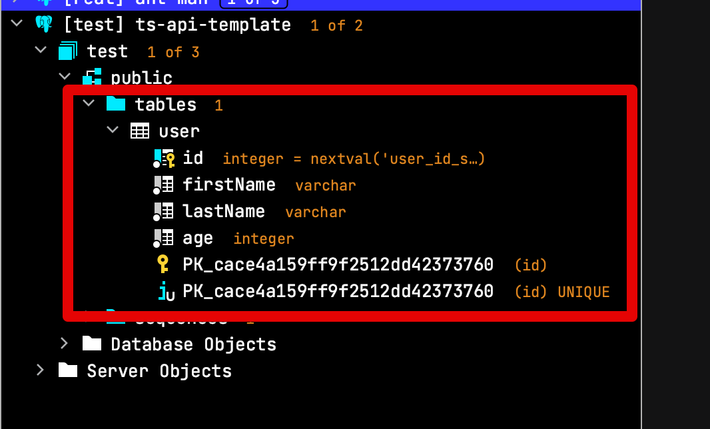

# 1. Typescript로 HTTP API 만들기 - TypeORM

## 1-1. TypeORM 설치하기

먼저 TypeORM CLI를 설치합니다.

```bash
npm install typeorm -g
```

설치된 CLI를 통해 Typeorm 기반의 보일러플레이트 프로젝트를 생성할 것인데요.  
아래 명령어로 수행합니다.

```bash
typeorm init --name ts-api-template --database pg
```

* `--database pg`
  * 사용할 데이터베이스의 드라이버를 설치합니다.
  * 여기서는 PostgreSQL을 사용할 예정이니 `pg` 를 등록합니다.  

그럼 아래와 같은 메세지와 함께 보일러플레이트가 생성됩니다.

```bash
Project created inside ..../ts-api-template directory.
```

기본 골격은 다음과 같습니다.

```bash
ts-api-template
├── src              // TypeScript code
│   ├── entity       // Entity 디렉토리
│   │   └── User.ts  // 샘플 Entity
│   ├── migration    // place where your migrations are stored
│   └── index.ts     // start point
├── .gitignore       
├── ormconfig.json   // ORM and database connection configuration
├── package.json     
├── README.md        
└── tsconfig.json    // TypeScript compiler options
```

추가 패키지 설치전에, 로컬 DB로 사용할 PostgreSQL의 접속 정보를 `ormconfig.json` 에 등록합니다.  

> 저는 Docker로 설치해서 사용하지만, 직접 로컬 설치하셔도 무방합니다.  
> 단순 로컬 실행 외에 테스트 코드는 [testcontainers-node](https://www.npmjs.com/package/testcontainers) 를 사용할 예정입니다.

만약 저와 같이 Docker로 설치하실 분들이라면 아래의 명령어로 실행하시면 됩니다.

```bash
docker run --rm \
    --name local-db \
    -e POSTGRES_DB=test \
    -e POSTGRES_USER=test \
    -e POSTGRES_PASSWORD=test \
    -p 5432:5432 \
    postgres
```

저처럼 Docker로 설치하신 분들이 아니시라면, 아래와 같은 접속 정보로 로컬 PostgreSQL을 설정하시면 됩니다.

* Database: `test`
* User: `test`
* Password: `test`
* Port: `5432`

그리고 여기서 사용한 접속 정보를 `ormconfig.json` 에 등록합니다.

```js
{
   "type": "postgres",
   "host": "localhost",
   "port": 5432,
   "username": "test",
   "password": "test",
   "database": "test",
   "synchronize": true,
   "logging": false,
   "entities": [
      "src/entity/**/*.ts"
   ],
   "migrations": [
      "src/migration/**/*.ts"
   ],
   "subscribers": [
      "src/subscriber/**/*.ts"
   ],
   "cli": {
      "entitiesDir": "src/entity",
      "migrationsDir": "src/migration",
      "subscribersDir": "src/subscriber"
   }
}
```

> 저의 경우엔 `ormconfig.json` 가 아닌 ``ormconfig.js` 로 변환해서 사용중입니다.  
> [TypeORM에서 Camelcase 필드를 Snake 컬럼에 매핑하기](https://jojoldu.tistory.com/568?category=635878) 를 위해서인데, 이는 이후에 테스트 코드 작성시에 다시 언급하게됩니다.

그럼 이제 `package.json`의 나머지 패키지들 설치를 위해 `npm install`을 수행합니다.

```bash
npm install
```

그리고 `npm start`를 수행합니다.

```bash
npm start
```

물론 WebStorm과 같이 IDE를 사용하신다면 굳이 Command를 사용하지 않고, **디버깅을 위해** IDE 디버그 모드로 수행하는 것도 좋습니다.

그럼 Typeorm의 Entity에 맞게 테이블이 자동으로 생성된 것을 Gui 도구를 통해 확인할 수 있습니다.



> 저는 JetBrains사의 [DataGrip](https://www.jetbrains.com/ko-kr/datagrip/)을 사용합니다.

## 1-2. 게시글 Entity 만들기

CLI로 생성해준 User 외에 게시글 Entity를 하나 만들어보겠습니다.  
TypeORM에서는 2가지 형태의 Entity 유형을 지원하는데요.  

**1. Active Record**

```js
import { Entity, PrimaryGeneratedColumn, Column, BaseEntity } from "typeorm";

@Entity()
export class User extends BaseEntity {

    @PrimaryGeneratedColumn()
    id: number;

    @Column()
    firstName: string;

    @Column()
    lastName: string;

    @Column()
    age: number;

}
```

```js
const user = new User();
user.firstName = "Timber";
user.lastName = "Saw";
user.age = 25;
await user.save();

const allUsers = await User.find();
const firstUser = await User.findOne(1);
const timber = await User.findOne({ firstName: "Timber", lastName: "Saw" });

await timber.remove();
```

**2. Data Mapper**

```js
import { Entity, PrimaryGeneratedColumn, Column } from "typeorm";

@Entity()
export class User {

    @PrimaryGeneratedColumn()
    id: number;

    @Column()
    firstName: string;

    @Column()
    lastName: string;

    @Column()
    age: number;

}
```

```js
const repository = connection.getRepository(User);

const user = new User();
user.firstName = "Timber";
user.lastName = "Saw";
user.age = 25;
await repository.save(user);

const allUsers = await repository.find();
const firstUser = await repository.findOne(1); // find by id
const timber = await repository.findOne({ firstName: "Timber", lastName: "Saw" });

await repository.remove(timber);
```

[TypeORM 공식 문서](https://typeorm.io/#/active-record-data-mapper/which-one-should-i-choose)에서는 둘 간의 차이를 아래와 같이 설명하고 추천합니다.

* Active Record
  * 모델 내에서 데이터베이스에 액세스하는 접근 방식
  * 규모가 작은 애플리케이션에서 적합하고, 단순하게 사용 가능
* Data Mapper
  * `Repository` 라는 별도의 클래스에 모든 쿼리 메서드를 정의하고 `Repository` 를 사용하여 개체를 저장, 제거, 로드 
  * 규모가 큰 애플리케이션에 적합하고 유지보수하는데 효과적

> JPA를 사용해보신 분들이라면 Data Mapper 방식이 JPA의 Entity & Repository 패턴과 비슷하여 쉽게 적응하실 수 있습니다.


## 1-3. TypeORM과 의존성 주입

* [typeorm-typedi-extensions](https://github.com/typeorm/typeorm-typedi-extensions)

```bash
npm install typeorm-typedi-extensions typedi
```


* https://jhyeok.com/node-backend-structure/
* https://github.com/JHyeok/jaebook-server
 
