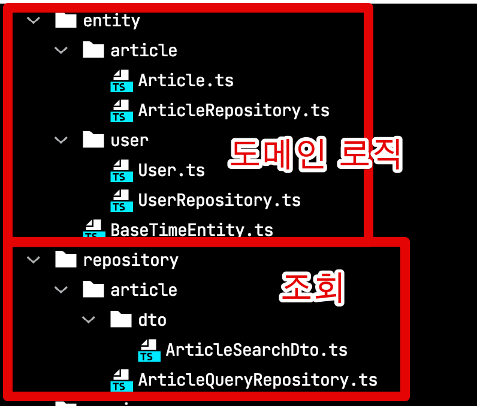
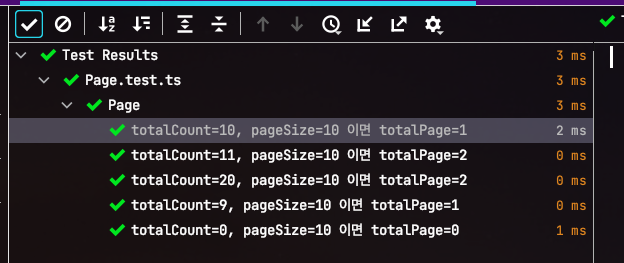
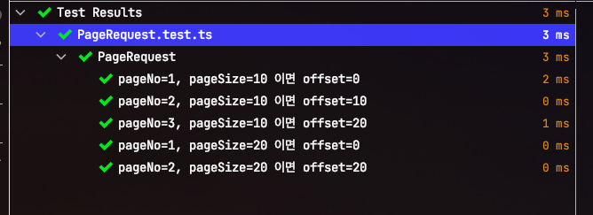

# 1. TypeORM에서 페이징 API 만들기 - 기본페이징 기능

웹 서비스를 구현하는 과정에서 페이징 API는 가장 기본적인 기능인데요.  
Java 기반의 페이징 구현 코드는 많은데, Typescript 와 TypeORM 의 구현 코드가 많지 않아 작성하게 되었습니다.  
  
현재 Typescript 와 TypeORM 스펙으로 웹 서비스를 구현하신다면 한번쯤 참고해보셔도 좋을것 같습니다.

> 전체 코드는 [Github](https://github.com/jojoldu/ts-api-template)에 있습니다.  

여기서는 기본적인 페이징에 대해서만 소개 드리는데요.  
**고성능의 페이징 API**가 필요하다면 이전의 포스팅들을 참고해주세요.

* [1. NoOffset 사용하기](https://jojoldu.tistory.com/528)
* [2. 커버링 인덱스 사용하기](https://jojoldu.tistory.com/529)
* [3-1. 페이지 건수 고정하기](https://jojoldu.tistory.com/530)
* [3-2. 첫 페이지 조회 결과 cache 하기](https://jojoldu.tistory.com/531)


## 1. 프로젝트 구조

사용된 대표적인 패키지는 다음과 같습니다.

* Typescript
* [TypeDI](https://www.npmjs.com/package/typedi)
  * [DI (Dependency Injection)](https://velog.io/@moongq/Dependency-Injection) 라이브러리
  * 아래 방식을 모두 지원
    * property based injection
    * constructor based injection
    * singleton and transient services
    * support for multiple DI containers
* TypeORM
* [typeorm-typedi-extensions](https://www.npmjs.com/package/typeorm-typedi-extensions)
  * 위 TypeORM의 Repository들을 DI 로 사용하기 위한 패키지
  * TypeDI를 통해 구현되어 있다.
* [Routing Controllers](https://www.npmjs.com/package/routing-controllers)
  * Rest API 용
  * 현재 **TypeDI를 지원하는 유일한** 패키지라서 선택
* Jest
  * 테스트 프레임워크
* Supertest
  * 실제 HTTP API를 호출해서 API 명세를 테스트할 수 있도록 지원합니다.
  * Jest와 호환이 잘 되어서, E2E (End To End) 테스트는 Supertest와 Jest를 조합합니다.

프로젝트 구조는 다음과 같습니다.

```bash
├─ src
│  ├─ app.ts
│  ├─ config # config 
│  ├─ controller # API Route
│  ├─ entity # ORM Entity & Command Repository
│  ├─ repository # Query Repository
│  ├─ service # Service Layer
│  │  ├─ Page.ts # Service Response Dto
│  │  ├─ PageWithoutCount.ts # Service Response Dto
├─ test
│  ├─ integration # Integration Test Dir
│  └─ unit # Unit Test Dir
```

> 위 Tree 구조는 [project-tree-generator](https://github.com/woochanleee/project-tree-generator)를 통해 생성했습니다.

여기서 Entity와 Repository가 분리된 것이 의아하실텐데요.  



Entity는 흔히 Domain이란 영역을 담당하고 있습니다.  
여기서 Command (등록/수정/삭제)는 Domain에 밀접하게 대응되지만,
Query (조회)는 **Domain 보다는 기능에 밀접**하게 됩니다.  
  
일반적으로 조회 기능은 도메인에 종속 되기 보다는 **기능마다 어떤 데이터를 노출하고싶은지**에 대응되기 마련인데요.  
  
그러다보니 서비스의 중요한 비지니스 로직은 대부분 데이터 변경 (등록/수정/삭제) 작업이고, 데이터 조회(R) 작업은 단순 데이터 조회입니다.  
(단순하다는 것이 덜 복잡함을 의미하진 않습니다.)  
(복잡한 조회 로직이지만, 비지니스 로직이 단순한 경우입니다.)  
  
이 2가지 업무를 같은 영역에서 다루다보면 **실제 도메인 로직이 아님에도 도메인 영역에서 다뤄야하는 경우가 빈번**합니다.  
  
이를테면 도메인이나 비지니스 상으로는 전혀 연관관계가 없는 도메인들이 실제 관리자 페이지에서 조합해서 노출이 필요한 경우가 정말 많습니다.  
이럴때 이 조회기능은 비지니스에 밀접한 도메인 로직이 아닌, 단순 조회기능일 뿐이고, 이럴 경우 저렇게 분리된 조회용 repository Layer에서 다루게 됩니다.

> 이런 패턴에 대해서 좀 더 자세히 알고싶으시다면 [나만 모르고 있던 CQRS & EventSourcing](https://www.popit.kr/cqrs-eventsourcing/) 을 보시길 추천드립니다.

이 외에 모든 Layer (Controller / Service / Repository / Entity 등)은 모두 DI (Dependency Injection)를 통하여 의존하게 둡니다.  
이로인해 각 Layer에 대한 모든 테스트가 독립적으로 / 편하게 구성할 수 있습니다.  
  
자 그럼 기본적인 설명이 끝났으니 바로 하나씩 구현해보겠습니다.

## 2. 페이징 API 코드

먼저 페이징 처리에 항상 사용될 Request Dto와 Response Body Dto를 생성합니다.  
  
### 2-1. 공통 코드

**PageRequest.ts**

```typescript
export abstract class PageRequest {
    pageNo: number| 1;
    pageSize: number| 10;

    getOffset(): number {
        return (this.pageNo-1) * this.pageSize;
    }

    getLimit(): number {
        return this.pageSize;
    }
}
```

* `getOffset`
  * Client에서는 pageNo와 pageSize로 값을 주지만, 백엔드 쿼리에서는 `offset`, `limit` 가 필요합니다.
  * 그래서 pageNo와 pageSize를 계산해서 `offset`으로 전환해주는 메소드를 함께 관리합니다.
* `getLimit`


**Page.ts**

```typescript
export class Page<T> {
  pageSize: number;
  totalCount: number;
  totalPage: number;
  items: T[];

  constructor(totalCount: number, pageSize: number, items: T[]) {
    this.pageSize = pageSize;
    this.totalCount = totalCount;
    this.totalPage = Math.ceil(totalCount/pageSize);
    this.items = items;
  }
}
```

페이징 결과를 담을 Page 클래스입니다.  
제네릭 (`<T>`)을 사용하여 다양한 타입을 허용하면서도 타입체크가 가능하도록 합니다.  
  
### 2-2. 구현 코드

이제 실제 페이징 코드를 작성해볼텐데요.  
(Entity 등 기타 코드들은 [Github](https://github.com/jojoldu/ts-api-template/tree/master/src)을 참고해보시면 됩니다.)  
  
> 다음엔 시리즈물로 Typescript와 TypeORM으로 HTTP API 만들기를 진행해보겠습니다.

페이징 코드는 Repository / Service / Controller 순으로 하나씩 보여드리겠습니다.  
  
**ArticleQueryRepository.ts**

```typescript
@EntityRepository(Article)
export class ArticleQueryRepository {
    ...
    paging(param: ArticleSearchRequest): Promise<[Article[], number]>{
        const queryBuilder = createQueryBuilder()
            .select([
                "article.id",
                "article.reservationDate",
                "article.title",
                "article.content"
            ]) // (1)
            .from(Article, "article")
            .limit(param.getLimit()) 
            .offset(param.getOffset()); // (2)

        if(param.hasReservationDate()) { // (3)
            queryBuilder.andWhere("article.reservationDate >= :reservationDate", {reservationDate: param.reservationDate})
        }

        if(param.hasTitle()) {
            queryBuilder.andWhere("article.title ilike :title", {title: `%${param.title}%`});
        }

        return queryBuilder
            .disableEscaping()
            .getManyAndCount(); // (4)
    }
    ...
}
```

(1) `select`

* Article Entity 그대로 조회할 수도 있지만, 실제 운영 환경에서는 Entity 단위로 조회하는 것은 **도메인 로직을 수행** (Entity 수정등의 비지니스로직) 할때가 대부분입니다.
* 그 외 단순 조회에서는 DTO (Data Transfer Object) 로 조회결과를 만듭니다.
* 단순 조회용 로직에 계속해서 Entity 단위 조회를 하게 되면 여러테이블의 결과를 함께 만들어서 보여줘야하는 경우 Lazy & Eager Loading으로 점칠된 코드가 나오게 되고 이는 성능/확장성/유지보수에 계속 악영향을 주게 됩니다.
* 단순 토이프로젝트에서는 Entity로 조회해서 View영역에 주는것도 문제는 없겠으나, 실제 운영에서라면 웬만하면 필요한 컬럼만 받고 필요하면 Join을 통해서 조립하는 등의 방법을 추천드립니다. 

(2) `.offset(param.getOffset())`

* `ArticleSearchRequest` 에세 `offset`에 대한 책임을 위임해서 값을 전달 받습니다.
* Repository 내부에서 처리하기 보다는 **각각의 객체가 본인의 임무를 담당하고 서로에게 위임**하는 형태에 익숙해지시길 추천드립니다.

(3) `if(param.hasReservationDate())`

* 동적 쿼리 (`reservationDate`가 있을 경우에만 조건문 추가 등) 를 위한 코드입니다.
* 현재 TypeORM에서는 위 방법외에는 동적 쿼리에 대한 지원이 없어 아쉽지만 위와 같이 작성해서 진행합니다.

(4) `getManyAndCount()`

* 실제 조회 쿼리의 결과와 count 쿼리 결과를 Array에 담아 반환해줍니다. 
* 위 쿼리에서 `offset`과 `limit`을 제거하고,  `select` 쿼리는 `select count(*)` 으로 변경해서 count를 반환해줍니다.

**ArticleService.ts**

```typescript
@Service() // (1)
export class ArticleService {
    constructor(
        @InjectRepository() private articleQueryRepository: ArticleQueryRepository, // (2)
        ) {}

    ...
    async search(param: ArticleSearchRequest) : Promise<Page<ArticleSearchItem>>{
        const result = await this.articleQueryRepository.paging(param);
        return new Page<ArticleSearchItem>(result[1], param.pageSize, result[0].map(e => new ArticleSearchItem(e))); // (3)
    }

    ...
```

(1) `@Service`

* `@Service`가 선언된 클래스는 TypeDI를 통해 의존성 등록
* 즉, Controller나 Middleware 등에서 이 Service 클래스를 DI 받고 싶다면 `@Service`가 선언 되어 있어야 합니다.
  * 반대로 등록된 의존성을 주입 받으려고 할때는 `@Inject`를 사용합니다. 

(2) `@InjectRepository`

* Repository를 주입 받게 해주는 `typeorm-typedi-extensions` 패키지의 데코레이터입니다.
* TypeDI에서는 공식적으로는 `@InjectRepository` 는 없고, `@Inject`만 존재하여 별도 패키지를 사용합니다.

(3) `result`

* `result[0]`: 수행된 조회 쿼리의 결과 데이터가 담겨 있습니다.
* `result[1]`: 수행된 조회 쿼리의 `count`가 담겨 있습니다.


**ArticleController.ts**

```typescript
@JsonController("/article")
export class ArticleController {
    constructor(private articleService: ArticleService) {}

    @HttpCode(200)
    @Get('/search')
    public async search(@QueryParams() param: ArticleSearchRequest, @Res() res: Response) {
        try{
            return await this.articleService.search(param);
        }catch (e) {
            logger.error('에러 발생', e);
            return e.message;
        }
    }
```

* 등록된 의존성인 `ArticleService`를 생성자 주입 (Constructor DI) 받아 사용합니다.

자 이렇게 구현된 코드들을 하나씩 테스트 코드를 통해 테스트해보겠습니다.

### 2-3. 테스트 코드

> 여기서 Jest와 Supertest 환경까지 구성하는 것을 소개드리진 않습니다.  
> [프로젝트 코드](https://github.com/jojoldu/ts-api-template)를 참고해서 직접 구성하셔도 좋고, 너무 복잡해서 못하겠다고 생각 드신다면 일단은 Postman 등을 통해서 직접 API를 호출해서 테스트해보셔도 됩니다.  
> Typescript를 이용한 API 만들기 시리즈물에서 테스트 환경 구축까지 상세히 다루겠습니다.

먼저 TotalCount와 PageSize를 받아 **TotalPage**가 몇인지 계산하는 `Page` 클래스를 테스트해보겠습니다.  
  
**Page.test.ts**

```typescript
describe('Page', () => {
    it.each([
        [10, 10, 1],
        [11, 10, 2],
        [20, 10, 2],
        [9, 10, 1],
        [0, 10, 0],
    ])('totalCount=%i, pageSize=%i 이면 totalPage=%i', (totalCount, pageSize, expected) => {
        expect(new Page(totalCount, pageSize, []).totalPage).toBe(expected);
    })
})
```

Jest의 `each`를 사용하면 위 Array의 값들이 순서대로 `totalCount, pageSize, expected` 에 담겨서 Array에 담긴 순서대로 모든 값들을 테스트 수행합니다.  
  
실제로 수행해보면 다음과 같이 `'totalCount=%i, pageSize=%i 이면 totalPage=%i'` 에 등록된 이름 그대로 모든 테스트가 수행되는 것을 확인할 수 있습니다.



다음으로는 `offset` **계산이 잘되는지** 검증 하기 위해 `PageRequest` 클래스를 테스트해보겠습니다.

**PageRequest.test.ts**

```typescript
describe('PageRequest', () => {
    it.each([
        [1, 10, 0],
        [2, 10, 10],
        [3, 10, 20],
        [1, 20, 0],
        [2, 20, 20],
    ])('pageNo=%i, pageSize=%i 이면 offset=%i', (pageNo, pageSize, offset) => {
        expect(new MockPageRequest(pageNo, pageSize).getOffset()).toBe(offset);
    })
})

class MockPageRequest extends PageRequest {

    constructor(pageNo: number, pageSize: number) {
        super();
        super.pageNo = pageNo;
        super.pageSize = pageSize;
    }
}
```

여기서 동일 클래스 파일 안에 `MockPageRequest`를 추가한 이유는 `PageRequest` 가 **추상 클래스**이기 때문입니다.  
추상 클래스는 **상속**대상이기 때문에 `new PageRequest`와 같이 인스턴스 생성이 안되는데요.  
그래서 테스트를 위해 테스트용 Mock클래스를 생성해서, 이를 검증합니다.



다음으로 페이징 쿼리를 테스트해볼텐데요.  
  
**ArticleQueryRepository.test.ts**

```typescript
describe('Article 조회 테스트', () => {
    let articleRepository: ArticleRepository;
    let articleQueryRepository: ArticleQueryRepository;
    let userRepository: UserRepository;

    beforeEach(async () => {
        articleRepository = getCustomRepository(ArticleRepository);
        articleQueryRepository = getCustomRepository(ArticleQueryRepository);
        userRepository = getCustomRepository(UserRepository);
    });
    
    ....

    it("paging + ilike ", async () => {
        const now = new Date();
        const targetTitle = 'Test';
        const article = Article.create(now, targetTitle, '테스트데이터', null);
        await articleRepository.save(article);

        //when
        const result = await articleQueryRepository.paging(ArticleSearchRequest.create(now, 'test', 1, 10));
        const entities = result[0];
        const count = result[1];
        //then
        expect(entities).toHaveLength(1);
        expect(entities[0].title).toBe(targetTitle);
        expect(count).toBe(1);
    });
}
```

PostgreSQL DB를 실행한뒤 (Docker or 직접 수행) 테스트를 위한 데이터를 넣은 뒤 (`await articleRepository.save(article)` ) 실제 테스트하고자 하는 `articleQueryRepository.paging`를 수행해서 결과를 검증합니다.  
  
마지막으로 E2E 테스트를 위해 Controller 를 검증합니다.

**ArticleController.test.ts**

```typescript

describe('ArticleController HTTP Request', () => {
    let app;
    let articleRepository;

    beforeAll(async ()=>{
        app = new App().app;
        articleRepository = getCustomRepository(ArticleRepository);
    });

    afterAll(async ()=>{
        app = null;
    });

    ...

    it("paging 조회", async () => {
        // given
        const title = 'title';
        const date = dayjs('2021-06-05').toDate();
        await articleRepository.save(Article.create(date, title, 'content', null));
        await articleRepository.save(Article.create(date, title, 'content', null));
        await articleRepository.save(Article.create(date, title, 'content', null));

        // when
        const res = await request(app)
            .get('/api/article/search')
            .query({pageNo: 1, pageSize: 10, reservationDate: '2021-01-10', title: title})
            .send();

        // then
        const items = res.body.items;
        expect(res.status).toBe(200);
        expect(res.body.totalCount).toBe(3);
        expect(items).toHaveLength(3);
        expect(items[0].title).toBe(title);
    });
    ...
}
```

Controller는 실제로 API 주소를 호출해서 정상적으로 결과가 반환되는지 검증합니다.  

## 3. 마무리

간단하게 Typescript와 TypeORM을 통해 페이징 API를 만들어보았습니다.  
사실 테스트 코드나 DI 등을 제외하면 훨씬 더 적은 코드로 구현할 수도 있는데요.  
다만 이렇게 할 경우 기능에만 집중할뿐 **팀 단위/서비스 운영 관점에서는 전혀 효용성이 없는 프로젝트**가 되기 쉽습니다.  
  
다음 시간에는 기존의 페이징 코드에서 `count`가 없는 형태의 API로 변경하는 것을 소개 드리겠습니다. 