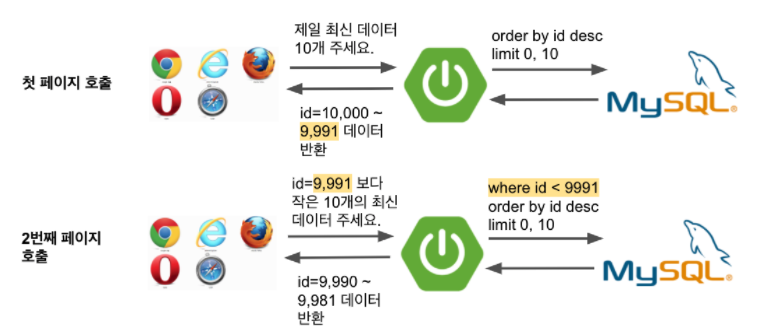

# TypeORM에서 페이징 API 만들기

## 2. Paging Without Count

기본적으로 더보기 방식은 아래와 같은 Flow를 가지는데요.



**클러스터 인덱스인 PK**를 이용해 조회 시작점을 지정해놓고 OFFSET 없이 조회하는 고성능의 쿼리 방식에 맞춥니다.  

* [NoOffset 사용하기](https://jojoldu.tistory.com/528)

다만, 이럴 경우 API를 호출하는 쪽 (Client)에서 

* 항상 이전 조회의 마지막 ID값을 가지고 있어야하고
* 다음 조회시 그 ID값을 인자로 항상 넣어줘야 

되는 것에 어색함을 느낄 수 있습니다.

> 개인적으로는 페이지 번호를 기억하는 것과 뭐가 다른가 싶은데, 막상 인터페이스를 사용하는 입장에서는 이질감을 느끼시는 분들이 꽤 있습니다.

그래서 이럴 경우 기존의 **페이지번호** 방식으로 더보기를 구현이 필요한데요.  
이렇게 할 경우 기존의 페이징 방식 보다 **전체 count 쿼리가 수행되지 않는다**는 장점이 있습니다.  
  
일반적으로 페이징 쿼리의 성능에는 count 쿼리도 지대한 영향을 주는데요.  
**이 조건에 해당하는 전체 데이터가 몇건인지**를 조회하는건 충분히 느린 쿼리가 되기 때문입니다.  
그래서 단순히 count 쿼리만 수행하지 않아도 거의 **절반에 가까운 응답 시간 단축**이 가능하니 꼭 [PK기반의 더보기](https://jojoldu.tistory.com/528)가 아니더라도 시도해보시면 좋습니다.  
  


### 2-1. 페이징 코드

**ArticleQueryRepository.ts**

```typescript
@EntityRepository(Article)
export class ArticleQueryRepository {
    ...
    pagingWithoutCount(param: ArticleSearchRequest): Promise<Article[]>{
        const queryBuilder = createQueryBuilder()
            .select([
                "article.id",
                "article.reservationDate",
                "article.title",
                "article.content"
            ])
            .from(Article, "article")
            .limit(param.getLimitWithNext()) // pageSize가 10개라면 11개를 조회한다.
            .offset(param.getOffset());

        if(param.hasReservationDate()) {
            queryBuilder.andWhere("article.reservationDate >= :reservationDate", {reservationDate: param.reservationDate})
        }

        if(param.hasTitle()) {
            queryBuilder.andWhere("article.title ilike :title", {title: `%${param.title}%`});
        }

        return queryBuilder
            .disableEscaping()
            .getMany(); // count는 사용하지 않는다.
    }
    ...
}
```

**PageRequest.ts**

```typescript
export abstract class PageRequest {
    ...
    getLimitWithNext(): number {
        return this.pageSize + 1;
    }
}
```

**PageWithoutCount.ts**

```typescript
export class PageWithoutCount<T> {
    pageSize: number;
    isNext: boolean;
    items: T[];

    constructor(pageSize: number, items: T[]) {
        this.pageSize = pageSize;
        this.setNext(items);
        this.setItems(items);
    }

    private setNext(items: T[]): void {
        this.isNext = items.length >= this.pageSize;
    }

    private setItems(items: T[]) {
        this.items = items;

        if(items.length > this.pageSize) {
            items.pop();
            this.items = items;
        }
    }
}
```

### 2-2. 테스트 코드

```typescript
    it("pagingWithoutCount에서는 pageSize가 2개여도 +1 개가 되어 조회된다", async () => {
        // given
        const now = new Date();
        const title = 'Test';
        const content = '테스트데이터';

        await articleRepository.save(Article.create(now, title, content, null));
        await articleRepository.save(Article.create(now, title, content, null));
        await articleRepository.save(Article.create(now, title, content, null));

        const pageSize = 2;
        const param = ArticleSearchRequest.create(now, 'test', 1, pageSize);

        //when
        const entities = await articleQueryRepository.pagingWithoutCount(param);

        //then
        expect(entities).toHaveLength(pageSize + 1);
    });
```

```typescript
    it("paging 더보기 조회", async () => {
        // given
        const title = 'title';
        const date = dayjs('2021-06-05').toDate();
        await articleRepository.save(Article.create(date, title, 'content', null));
        await articleRepository.save(Article.create(date, title, 'content', null));
        await articleRepository.save(Article.create(date, title, 'content', null));

        // when
        const res = await request(app)
            .get('/api/article/search-more')
            .query({pageNo: 1, pageSize: 2, reservationDate: '2021-01-10', title: title})
            .send();

        // then
        const items = res.body.items;
        expect(res.status).toBe(200);
        expect(res.body.isNext).toBeTruthy();
        expect(items).toHaveLength(2);
        expect(items[0].title).toBe(title);
    });
```


## 마무리

이번 글에서 소개한 내용들은 모두 기본적인 페이징 방식을 이야기하는데요.  
  
페이징은 성능 이슈가 심하기 때문에, 결과적으로 운영 환경의 데이터가 많아지면 많아질수록 다른 방식으로 개선해야만 합니다.  
  
그럴땐 아래 글들을 참고해보시면 좋습니다.  
모두 고성능의 페이징 API를 구현 하는 방법을 Java & JPA & Querydsl로 소개하였는데요.  
지금 사용하고 있는 개발 환경과 다르더라도 **컨셉 자체는 그대로 사용하시면** 되기 때문에 어떤 컨셉인지 한번쯤은 익히고 가시면 이후 시스템 확장이나 데이터 증가에 대응하실때 많은 도움이 될 수 있습니다.

* [1. NoOffset 사용하기](https://jojoldu.tistory.com/528)
* [2. 커버링 인덱스 사용하기](https://jojoldu.tistory.com/529)
* [3-1. 페이지 건수 고정하기](https://jojoldu.tistory.com/530)
* [3-2. 첫 페이지 조회 결과 cache 하기](https://jojoldu.tistory.com/531)


