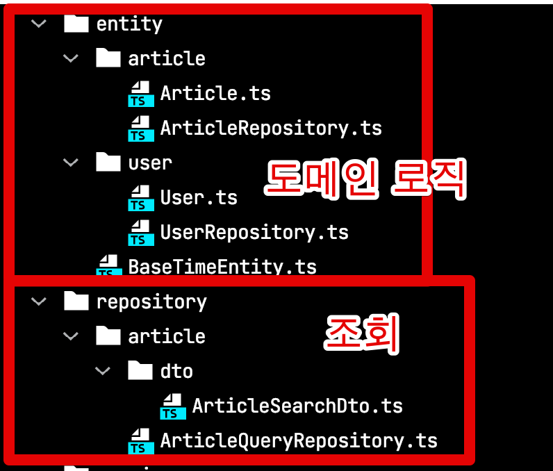

# TypeORM에서 페이징 API 만들기

웹 서비스를 구현하는 과정에서 페이징 API는 가장 기본적인 기능인데요.  
Java 기반의 페이징 구현 코드는 많은데, Typescript 와 TypeORM 의 구현 코드가 많지 않아 작성하게 되었습니다.  
  
현재 Typescript 와 TypeORM 스펙으로 웹 서비스를 구현하신다면 한번쯤 참고해보셔도 좋을것 같습니다.

> 전체 코드는 [Github](https://github.com/jojoldu/ts-api-template)에 있습니다.  

여기서는 기본적인 페이징에 대해서만 소개 드리는데요.  
**고성능의 페이징 API**가 필요하다면 이전의 포스팅들을 참고해주세요.

* [1. NoOffset 사용하기](https://jojoldu.tistory.com/528)
* [2. 커버링 인덱스 사용하기](https://jojoldu.tistory.com/529)
* [3-1. 페이지 건수 고정하기](https://jojoldu.tistory.com/530)
* [3-2. 첫 페이지 조회 결과 cache 하기](https://jojoldu.tistory.com/531)


## 0. 프로젝트 구조

사용된 대표적인 패키지는 다음과 같습니다.

* Typescript
* [TypeDI](https://www.npmjs.com/package/typedi)
  * [DI (Dependency Injection)](https://velog.io/@moongq/Dependency-Injection) 라이브러리
  * 아래 방식을 모두 지원
    * property based injection
    * constructor based injection
    * singleton and transient services
    * support for multiple DI containers
* TypeORM
* [Routing Controllers](https://www.npmjs.com/package/routing-controllers)
  * Rest API 용
  * 현재 **TypeDI를 지원하는 유일한** 패키지라서 선택
* Jest
  * 테스트 프레임워크

프로젝트 구조는 다음과 같습니다.

```bash
├─ src
│  ├─ app.ts
│  ├─ config # config 
│  ├─ controller # API Route
│  ├─ entity # ORM Entity & Command Repository
│  ├─ repository # Query Repository
│  ├─ service # Service Layer
│  │  ├─ Page.ts # Service Response Dto
│  │  ├─ PageWithoutCount.ts # Service Response Dto
├─ test
│  ├─ integration # Integration Test Dir
│  └─ unit # Unit Test Dir
```

> 위 Tree 구조는 [project-tree-generator](https://github.com/woochanleee/project-tree-generator)를 통해 생성했습니다.

여기서 Entity와 Repository가 분리된 것이 의아하실텐데요.  



Entity는 흔히 Domain이란 영역을 담당하고 있습니다.  
여기서 Command (등록/수정/삭제)는 Domain에 밀접하게 대응되지만,
Query (조회)는 **Domain 보다는 기능에 밀접**하게 됩니다.  
  
일반적으로 조회 기능은 도메인에 종속 되기 보다는 **기능마다 어떤 데이터를 노출하고싶은지**에 대응되기 마련인데요.  
  
그러다보니 서비스의 중요한 비지니스 로직은 대부분 데이터 변경 (등록/수정/삭제) 작업이고, 데이터 조회(R) 작업은 단순 데이터 조회입니다.  
(단순하다는 것이 덜 복잡함을 의미하진 않습니다.)  
(복잡한 조회 로직이지만, 비지니스 로직이 단순한 경우입니다.)  
  
이 2가지 업무를 같은 영역에서 다루다보면 **실제 도메인 로직이 아님에도 도메인 영역에서 다뤄야하는 경우가 빈번**합니다.  
  
이를테면 도메인이나 비지니스 상으로는 전혀 연관관계가 없는 도메인들이 실제 관리자 페이지에서 조합해서 노출이 필요한 경우가 정말 많습니다.  
이럴때 이 조회기능은 비지니스에 밀접한 도메인 로직이 아닌, 단순 조회기능일 뿐이고, 이럴 경우 저렇게 분리된 조회용 repository Layer에서 다루게 됩니다.

> 이런 패턴에 대해서 좀 더 자세히 알고싶으시다면 [나만 모르고 있던 CQRS & EventSourcing](https://www.popit.kr/cqrs-eventsourcing/) 을 보시길 추천드립니다.

이 외에 모든 Layer (Controller / Service / Repository / Entity 등)은 모두 DI (Dependency Injection)를 통하여 의존하게 둡니다.  
이로인해 각 Layer에 대한 모든 테스트가 독립적으로 / 편하게 구성할 수 있습니다.  
  
자 그럼 기본적인 설명이 끝났으니 바로 하나씩 구현해보겠습니다.

## 1. 기본 페이징 API 구성

먼저 페이징 처리에 항상 사용될 Request Dto와 Response Body Dto를 생성합니다.  
  
### 1-1. 공통 코드

**PageRequest.ts**

```typescript
export abstract class PageRequest {
    pageNo: number| 1;
    pageSize: number| 10;

    getOffset(): number {
        return (this.pageNo-1) * this.pageSize;
    }

    getLimit(): number {
        return this.pageSize;
    }
}
```

* `getOffset`
  * Client에서는 pageNo와 pageSize로 값을 주지만, 백엔드 쿼리에서는 `offset`, `limit` 가 필요합니다.
  * 그래서 pageNo와 pageSize를 계산해서 `offset`으로 전환해주는 메소드를 함께 관리합니다.
* `getLimit`


**Page.ts**

```typescript
export class Page<T> {
  pageSize: number;
  totalCount: number;
  totalPage: number;
  items: T[];

  constructor(totalCount: number, pageSize: number, items: T[]) {
    this.pageSize = pageSize;
    this.totalCount = totalCount;
    this.totalPage = Math.ceil(totalCount/pageSize);
    this.items = items;
  }
}
```

* `createByManyAndCount`


### 1-2. 페이징 코드

**ArticleQueryRepository.ts**

```typescript
@EntityRepository(Article)
export class ArticleQueryRepository {
    ...
    paging(param: ArticleSearchRequest): Promise<[Article[], number]>{
        const queryBuilder = createQueryBuilder()
            .select([
                "article.reservationDate",
                "article.title",
                "article.content"
            ]) // Lazy Loading이 필요없다면 필요한 컬럼만
            .from(Article, "article")
            .limit(param.getLimit())
            .offset(param.getOffset());

        if(param.hasReservationDate()) {
            queryBuilder.andWhere("article.reservationDate >= :reservationDate", {reservationDate: param.reservationDate})
        }

        if(param.hasTitle()) {
            queryBuilder.andWhere("article.title ilike :title", {title: `%${param.title}%`});
        }

        return queryBuilder
            .disableEscaping()
            .getManyAndCount();
    }
}
```

**
### 1-3. 테스트 코드

```typescript
describe('Page', () => {
    it.each([
        [10, 10, 1],
        [11, 10, 2],
        [20, 10, 2],
        [9, 10, 1],
        [0, 10, 0],
    ])('totalCount=%i, pageSize=%i 이면 totalPage=%i', (totalCount, pageSize, expected) => {
        expect(new Page(totalCount, pageSize, []).totalPage).toBe(expected);
    })
})
```

```typescript
it("paging + ilike ", async () => {
    const now = new Date();
    const targetTitle = 'Test';
    const article = Article.create(now, targetTitle, '테스트데이터', null);
    await articleRepository.save(article);

    //when
    const result = await articleQueryRepository.paging(ArticleSearchRequest.create(now, 'test', 1, 10));
    const entities = result[0];
    const count = result[1];
    //then
    expect(entities).toHaveLength(1);
    expect(entities[0].title).toBe(targetTitle);
    expect(count).toBe(1);
});
```

## 2. Paging Without Count


### 2-1. 페이징 코드

### 2-2. 테스트 코드

```typescript
    it("pagingWithoutCount에서는 pageSize가 2개여도 +1 개가 되어 조회된다", async () => {
        // given
        const now = new Date();
        const title = 'Test';
        const content = '테스트데이터';

        await articleRepository.save(Article.create(now, title, content, null));
        await articleRepository.save(Article.create(now, title, content, null));
        await articleRepository.save(Article.create(now, title, content, null));

        const pageSize = 2;
        const param = ArticleSearchRequest.create(now, 'test', 1, pageSize);

        //when
        const entities = await articleQueryRepository.pagingWithoutCount(param);

        //then
        expect(entities).toHaveLength(pageSize + 1);
    });
```


이렇게 API 인터페이스를 구현하면 이후엔 [더보기 방식](https://jojoldu.tistory.com/528) (```No Offset / Without Offset```) 으로 구성하기가 편해집니다.  
  
현재 테이블의 데이터가 수십만건 밖에 되지 않는다면 굳이 더보기 방식을 선택할 필요는 없으니 무리하게 변경할 필요는 없습니다.

## 마무리

이번 글에서 소개한 내용들은 모두 기본적인 페이징 방식을 이야기하는데요.  
  
페이징은 성능 이슈가 심하기 때문에, 결과적으로 운영 환경의 데이터가 많아지면 많아질수록 다른 방식으로 개선해야만 합니다.  
  
그럴땐 아래 글들을 참고해보시면 좋습니다.  
모두 고성능의 페이징 API를 구현 하는 방법을 Java & JPA & Querydsl로 소개하였는데요.  
지금 사용하고 있는 개발 환경과 다르더라도 **컨셉 자체는 그대로 사용하시면** 되기 때문에 어떤 컨셉인지 한번쯤은 익히고 가시면 이후 시스템 확장이나 데이터 증가에 대응하실때 많은 도움이 될 수 있습니다.

* [1. NoOffset 사용하기](https://jojoldu.tistory.com/528)
* [2. 커버링 인덱스 사용하기](https://jojoldu.tistory.com/529)
* [3-1. 페이지 건수 고정하기](https://jojoldu.tistory.com/530)
* [3-2. 첫 페이지 조회 결과 cache 하기](https://jojoldu.tistory.com/531)


