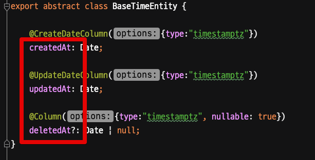
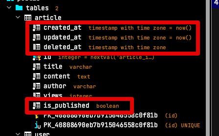
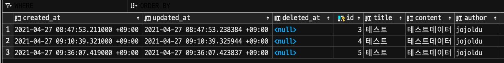
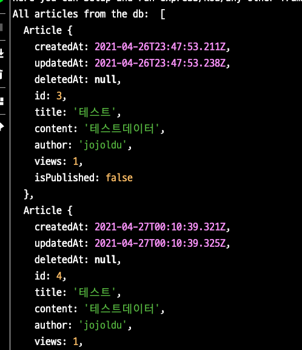

# TypeORM에서 카멜케이스 필드를 스네이크 컬럼에 매핑하기

일반적으로 PostgreSQL을 비롯한 Database의 컬럼 명명 (Naming) 규칙은 snake, 애플리케이션 코드의 필드 명명 규칙은 Camelcase 입니다.  

**Entity**



**Table**



둘 간에 명명 규칙이 달라 일반적인 ORM 들 (JPA등) 에서는 이들간의 불일치 해소를 위한 명명 전략 (**Naming Strategy**)를 지원하는데요.  
  
TypeORM에서는 이 기능이 공식적인 지원이 없어서, 별도의 패키지를 사용해야만 합니다.  
  
## 해결책

npm 패키지 중 [typeorm-naming-strategies](https://www.npmjs.com/package/typeorm-naming-strategies) 를 사용하면 이 문제를 아주 쉽게 해결할 수 있습니다.
  
먼저 아래와 같이 프로젝트 패키지에 포함시키시고,
```bash
npm install typeorm-naming-strategies --save
```

TypeORM **전역에서 적용**되도록 `ormconfig.js` 에 추가옵션으로 등록합니다.

> `ormconfig.json` 이 아닌 `ormconfig.js` 를 사용합니다.


```js
const SnakeNamingStrategy = require('typeorm-naming-strategies')
    .SnakeNamingStrategy;

module.exports = {
    "type": "postgres",
    "host": "localhost",
    "port": 5432,
    "username": "test",
    "password": "test",

    ...
    namingStrategy: new SnakeNamingStrategy(),
}
```

이렇게 하시면 모든 설정은 끝납니다.

## 테스트

일반 Entity와 상속된 Entity에서 모두 잘 되는지 확인하기 위해 테스트용 Entity는 다음과 같이 구성합니다.  
  
**BaseTimeEntity**

```js
export abstract class BaseTimeEntity {

    @CreateDateColumn({type:"timestamptz"})
    createdAt: Date;

    @UpdateDateColumn({type:"timestamptz"})
    updatedAt: Date;

    @Column({type:"timestamptz", nullable: true})
    deletedAt?: Date | null;
}
```

**Article**

```js
@Entity()
export class Article extends BaseTimeEntity{
    @PrimaryGeneratedColumn()
    private id: number;

    @Column()
    private title: string;

    @Column("text")
    private content: string;

    @Column()
    private author: string;

    @Column()
    private views: number;

    @Column()
    private isPublished: boolean;
}
```

그리고 애플리케이션을 실행하시면 명명 규칙 전환 기능이 정상작동하는 것을 확인할 수 있습니다.




